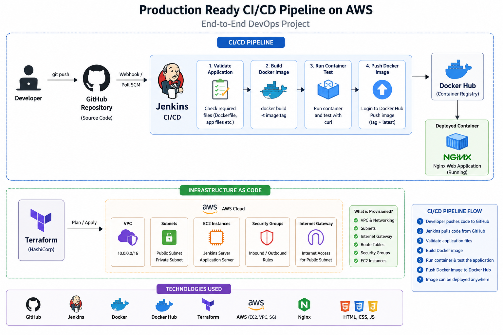

# 🚀 Production-Ready CI/CD Pipeline on AWS

A hands-on DevOps project demonstrating a production-style CI/CD pipeline using GitHub, Jenkins, Docker, Docker Hub, Terraform, and AWS infrastructure as code.

> **Note:** AWS infrastructure is defined using Terraform and stored in this repository. The infrastructure was not deployed to AWS as part of this project.

---

## 📌 Project Overview

This project demonstrates how application source code can move through a CI/CD pipeline:

GitHub → Jenkins → Docker Build → Container Test → Docker Hub

Terraform is used to define the AWS infrastructure as code.

The project is designed to demonstrate practical DevOps concepts such as:

- Source code management
- Continuous Integration
- Continuous Delivery
- Infrastructure as Code
- Docker containerization
- Automated container testing
- Docker image publishing
- Jenkins pipeline automation

---

## 🏗️ Architecture



---

## 🛠️ Technologies Used

| Technology | Purpose |
|---|---|
| Git | Version control |
| GitHub | Source code repository |
| Jenkins | CI/CD automation |
| Docker | Application containerization |
| Docker Hub | Container image registry |
| Terraform | Infrastructure as Code |
| Nginx | Web server |
| AWS | Target cloud infrastructure |

---

## 🔄 CI/CD Pipeline Workflow

The pipeline follows these stages:

### 1. Developer Pushes Code

The developer pushes application changes to GitHub.

```text
Developer
    ↓
Git Push
    ↓
GitHub

## 🔧 Jenkins Setup

### 1. Start Jenkins

Jenkins can be run using Docker.

```bash
docker run -d \
  --name jenkins \
  -p 8080:8080 \
  -p 50000:50000 \
  -v jenkins_home:/var/jenkins_home \
  -v /var/run/docker.sock:/var/run/docker.sock \
  jenkins/jenkins:lts